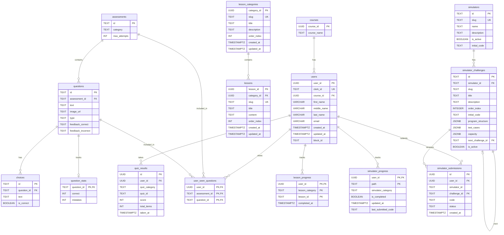

# VisualDS Database Schema

Here is the Mermaid JS Entity-Relationship (ER) diagram representing the current database schema in the backend. Unused fields (if any) are omitted, and relations reflect the active query and data models.

